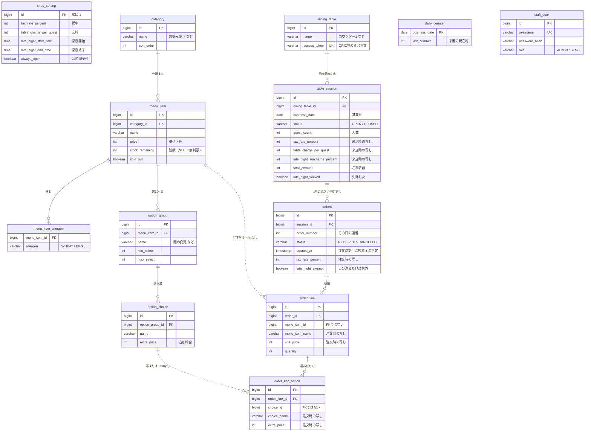

# データベース構成と、データの置き場所

テーブルは 13 個。役割で 3 つの層に分かれていて、**層をまたぐときだけ設計に理由がある**。
商品マスタと注文明細がつながっていないのは、つなぎ忘れではなく、会計の証跡を守るための切断。

---

## 1. データはどこにあるか

すべて**この PC のプロジェクトフォルダの中**。クラウドにも外部サービスにも送っていない。

| 場所 | 中身 |
|---|---|
| `data\komeko.mv.db` | **本体。13 テーブルすべてがこのファイル 1 つ。**<br>H2 という「ファイル 1 個で動く DB」なのでサーバもインストールも不要。<br>注文も伝票も会計もここ。**これを失うと全部失う。** |
| `data\uploads\` | 商品画像の実体。DB には `image_path`（`/uploads/cat-takoyaki.jpg` のような文字列）だけが入る。<br>**DB だけ戻しても画像は戻らない。** |
| `backups\<日時>\` | DB と画像を丸ごと退避したもの。14 世代。<br>毎日 4:30 ／ 起動時（20 時間以上空いていたら）／ アプリ終了時 の 3 つのきっかけで自動。 |
| `data\komeko.trace.db` | H2 のエラーログ。消しても動く。データは入っていない。 |
| `data\tomcat\logs\access_log.*.log` | どの端末からアクセスが来たかの記録（開発時の切り分け用）。業務データではない。 |

> ⚠️ **いまの弱点。** DB も画像もバックアップも全部同じディスクの上にある。
> 停電では H2 が壊れないよう作ってあるが、**ディスクが物理的に壊れたら 3 つとも同時に消える**。
> `application.yml` の `app.backup.extra-copy-dir` に USB ドライブか OneDrive のフォルダを
> 書いておくと、そこにも複製が置かれる。

---

## 2. ER 図

実線が外部キー（DB が整合性を守る本物のつながり）。
**点線は「番号を控えているだけ」**でつながっていない関係。点線が最重要の設計判断（4 章）。



---

## 3. 3 つの層

どのテーブルがどの層かを覚えておくと、「これは書き換えていいのか」がほぼ自動で決まる。

### マスタ（Master）

`shop_setting` `category` `menu_item` `menu_item_allergen`
`option_group` `option_choice` `dining_table`

店が決めるもの。管理画面からいつでも書き換える。値上げも品切れも卓の増減もここを直すだけ。
**過去の会計には一切影響しない。**

### 取引（Transaction）

`table_session` `orders` `order_line` `order_line_option`

営業中に増え続ける記録。お金そのもの。
**いったん記録したら中身を書き換えない**（取り消しは状態を変えるだけで、行は残す）。
金額と商品名は注文した時点の値を写して持つ。

### 運用（Operation）

`daily_counter` `staff_user`

仕組みを回すための裏方。お客さんからは見えない。注文番号の採番とスタッフのログイン情報だけ。

---

## 4. なぜこう分けたのか

### 商品マスタと注文明細が外部キーでつながっていないのはなぜか

**会計の証跡を守るため。**

もし `order_line` が `menu_item` を参照していたら、店長が「肉玉米粉そば」を
1,180 円から 1,280 円に値上げした瞬間、**先週のレシートまで 1,280 円に化ける**。
商品を削除したら、その商品を頼んだ過去の注文が壊れる。

だから明細は、注文が入った瞬間に**商品名・単価・オプション名・追加料金をすべて写し取って**自分で持つ。
`menu_item_id` は残しているが、これは「どれだったか調べたいとき用の手がかり」であって、
金額の計算には一切使わない。ER 図の点線がこれ。

### 同じ「税率」が 3 つのテーブルにあるのはなぜか

- `shop_setting` … **これから使う値**
- `table_session` … **その来店に適用する値**
- `orders` … **その注文に適用した値**

来店した瞬間に設定が伝票へ写り、注文した瞬間に伝票から注文へ写る。
だから営業中に税率や席料を変えても、**いま座っているお客さんの金額は動かない**。
重複して見えるが、これは冗長ではなく「いつ時点の値か」の記録。

### 深夜料金だけ、写さずに毎回計算し直している

割増**率**（10%）は伝票に写すが、「かかるかどうか」は写さない。
深夜料金は**注文した時刻**で決まるので、`orders.created_at` を見て注文 1 件ずつ判定する。
22:00 の注文は通常料金、23:30 の注文は深夜料金、と同じ伝票で混ざる（詳しくは `仕様.md` 4.2）。

人の判断だけは記録する。

- `orders.late_night_exempt` … この注文だけ対象外（打ち直しの救済）
- `table_session.late_night_waived` … 伝票まるごと免除

**計算で再現できないものだけを持たせる**、という切り分け。

### テーブル名が `orders` と複数形なのはなぜか

`ORDER` が SQL の予約語（`ORDER BY`）だから。そのまま `order` という名前のテーブルを作ると、
クエリを書くたびに引用符が要るか、構文エラーになる。
Java 側のクラス名は `Order` のまま、`@Table(name = "orders")` で DB 側だけ別名にしている。

### `daily_counter` が主キーに日付を使っている

注文番号は営業日ごとに 101 から振り直すので、**「その営業日の現在地」を 1 行で持てば足りる**。
採番のときはこの行に鍵をかけ（悲観ロック）、番号を 1 つ進めてすぐ手放す。
同時に 2 人が注文しても同じ番号にならず、ロックを握る時間も最短で済む。

### 卓の QR には何が入っているのか

`dining_table.access_token`（36 文字のランダムな文字列）。
`http://192.168.1.4:8080/t/8c3eade4-…` の形で QR に埋めてある。

**卓番号そのものを URL に入れていない**のは、`/t/3` のような URL だと
数字を変えるだけで他の卓の伝票を開けてしまうから。推測できない合言葉にしてある。

---

## 5. 中身を直接見たいとき

アプリを起動したまま、ブラウザで H2 コンソールを開く（dev プロファイルのみ有効）。

```
http://localhost:8080/h2-console
  JDBC URL : jdbc:h2:file:./data/komeko
  ユーザー名 : sa
  パスワード : （空欄）
```

コマンドラインから触るときは**必ずアプリを止めてから**。
起動中はファイルがロックされていて開けない。日本語リテラルが化けるので、
SQL は ASCII だけで書き（例: `WHERE sort_order = 10`）、日本語での絞り込みは避けること。
