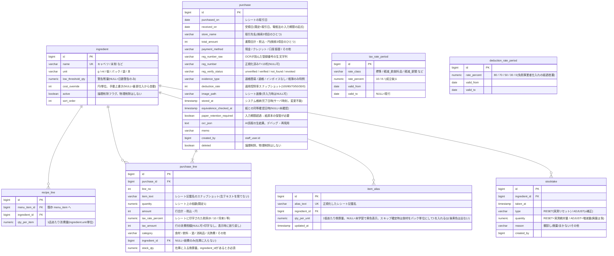

# 仕入れ・在庫・原価管理 設計書

**ステータス: 設計確定・実装未着手**(初版 2026-08-29 / v2 2026-08-30)。
店主打ち合わせ待ちの項目あり(10章)。着手前バックアップ済み(`projects\komeko-teppan-order_バックアップ_20260829`)。
v2 の追記: 税理士向け展開の2段構想(0章)、行単位の税率・カテゴリ(2章)、税制対応(7章)、電子帳簿保存法要件(2章・5章・6章)。
法要件・市場調査の詳細は `projects\_index\税理士向け展開-法要件市場調査-20260830.md`(出典URL付き)。
実装が進んだら、確定した仕様は `仕様.md` へ移し、この文書は設計判断の記録として残す。

---

## 0. これは何か

**レシートをスマホで撮ると仕入れと経費が記録され、QRオーダーの注文データと合わさって「食材があと何日もつか」「原価率はいくらか」が見えるようになる**、komeko-teppan-order への追加モジュール。

背景: 店主が前職で使っていたエクセル(商品名・材料・売価・原価率・原価)の再現が出発点。
エクセルでは単価を手で写して原価を手計算していたが、ここでは**単価がレシート読取から自動で入り、仕入値が上がると原価率も自動で動く**。さらに注文データがあるので、エクセルには不可能だった**在庫の自動減算と欠品予測**までつながる。

```
【入庫】レシート撮影 → AIが品目・金額・税率・登録番号を読取 → 確認画面で修正+食材に紐付け → 仕入れ記録
【出庫】QRオーダーの注文明細 × レシピ(1品あたりの食材消費量) → 消費量を自動計算
【現在庫】直近の棚卸し値 + それ以降の入庫 − 消費 − 廃棄補正
【予測】直近28日の営業日平均消費 → 「キャベツ あと約2営業日」+ 警告表示
【原価】理論原価率(レシピ×単価) と 実際原価率(食材仕入÷売上) の2本立て(税込・税抜の両建て)
```

### 最終ターゲットは税理士事務所 — 2段ロケット

このモジュールの最終目標は**税理士事務所向けSaaS**。顧問先飲食店の売上(QR注文)と仕入(レシート)を構造化し、税理士の記帳と店の在庫管理の両方を楽にする。店は在庫のためにレシートを撮る → その副産物として税理士に税率区分・証憑つきの帳簿データが流れる、というインセンティブ構造が核。

- **1段目(本設計書の範囲)**: komeko 内のパイロット。米粉と鉄板で「店は撮り続けるか」「税理士は楽になるか」を n=1 検証
- **2段目(検証通過後)**: 独立マルチテナントSaaS。データモデル・AI読取・在庫計算はパイロットからほぼ1:1で移植

このため1段目から、電子帳簿保存法(スキャナ保存)とインボイス制度の要件をスキーマに織り込む(2章・7章)。
市場調査の結論: 「レシート明細行→在庫原価→記帳」の一気通貫は競合不在。飲食店主への低単価直販は先行例(カシオHANJO会計)が撤退済みで、税理士事務所チャネルが構造的に正しい。

---

## 1. 運用の思想 — 「ゆるい在庫管理」

グラム単位の厳密管理は現場では必ずズレる(目分量・ロス・まかない)。だからこの設計は
**普段は自動計算、ズレたら棚卸しでリセット**というゆるい運用を前提にする。
以下の 3 原則がすべての画面設計・データ設計を貫く。

### 原則1: 厨房の知識はコードに埋めず、データにする

開発者(zaki)は調理に入っていない。厨房の感覚が必要な数字は、**それを知っている人が、知っているタイミングで入力する**仕組みにする。

| 厨房の知識 | 誰がいつ入れるか |
|---|---|
| エリンギ1パック何g? | 仕入れた本人が、レシート確認画面で初回に1回 |
| お好み焼き1枚に米粉何g? | 店主が、レシピ画面で好きなタイミングに |
| 棚卸しの実測値 | 厨房の人が、ズレが気になったとき |

### 原則2: 撮るべきものはシステムが指名する(人は覚えない)

買い出し後の導線: 食材をしまう**前に**レシートを撮る → 確認画面で入り数が未学習の品だけ**黄色表示**「エリンギ、量が分かりません 📷」→ まだ手元にあるので、言われた品だけパッケージを撮る → AIが内容量表示(「100g」)を読む。
「どれが未登録だっけ」と人が考える場面を作らない。

### 原則3: サボっても絶対に詰まらない(多段フォールバック)

| 対応 | 結果 |
|---|---|
| 📷 商品写真を撮る | 内容量をAIが読んでグラム管理(理想) |
| 手入力 | 「たしか100gくらい」でOK。ズレは棚卸しで吸収 |
| スキップ | その食材は自動で**パック単位管理**になる(換算不要。レシピも「0.5パック」で書ける)。後からいつでもグラム管理に昇格可 |
| 在庫に紐付けない | 経費としてだけ記録(洗剤・割り箸など)。お金の集計は完全に機能する |

入り数の学習は品目ごとに 1 回きり。飲食店の仕入れは同じ物の繰り返し(せいぜい20〜40品目)なので、
黄色表示は**運用初週に集中し、2〜3週間でほぼゼロに収束**する。初期セットアップでよく買う食材を先に登録すればさらに減る。

---

## 2. データ設計 — 新テーブル8つ、既存テーブルの変更ゼロ

**既存13テーブルには列1本足さない。** 過去の起動不能事故(2026-08-18、NOT NULL列追加)と同じ轍を踏まないため、追加はすべて新テーブルで行う。在庫系6つ+税制系2つ。



### 既存テーブルとのつながり

- `recipe_line.menu_item_id` → 既存 `menu_item` に**本物のFK**を張る(レシピは履歴ではなく現在の設定なので、整合性をDBに守らせる)
- 消費計算は既存 `order_line.menu_item_id`(FKなしの控え番号。**確認済み: 列は存在する**)と `recipe_line` を突き合わせる。**読むだけ。書かない。**
- `purchase_line.item_text` はスナップショット。食材名を後で変えても過去の記録は変わらない(既存の `order_line` と同じ思想)

### 既存規約の踏襲と、税・数量の持ち方

- 金額は **int・円・税込**。数量だけは 0.5パックがあり得るので numeric(BigDecimal)
- **保存の正は税込(レシートに印字された数字)**。税抜は `TaxCalculator.netAmount`(既存)で表示のたびに計算する。逆(税抜保存→税込計算)は端数で紙と合わなくなるので禁止
- **税率もカテゴリも明細行に持つ**(v2変更)。スーパーのレシート1枚に食材8%と洗剤10%が混在するのが常態のため、レシート単位では持てない
- 税率・税額は**レシートに実際に印字された値**を保存する(マスタからの推定で上書きしない)。施行日前後の返品・月またぎで、取引日+マスタでは再現できないケースがあるため
- `ingredient` は論理削除のみ(履歴が参照しているため)。既存の `menu_item.stock_remaining`(販売残数)とは**別物として共存**し、混ぜない

### 電子帳簿保存法(スキャナ保存)対応の設計原則

「紙のレシートを捨てられるシステム」にするための要件(国税庁一問一答・令和7年6月版に基づく。詳細は _index の調査レポート):

| 要件 | この設計での対応 |
|---|---|
| 訂正削除の履歴(版管理4要件) | `purchase` / `purchase_line` は**物理削除禁止**。訂正は全版保持、削除は論理削除フラグ、削除済みも検索対象に含める |
| 保存時刻の客観的担保 | `stored_at` をサーバ時刻(NTP同期)で記録し、以後変更不能にする。SaaS提供形態なら認定タイムスタンプ契約は不要(問31・32) |
| 検索3項目 | 取引年月日(`purchased_on`)・書類合計額(`total_amount`)・取引先名(`store_name`)を必須列に。範囲指定+AND検索UI+CSVエクスポート(税務調査のダウンロード応需) |
| 入力期限(速やか=概ね7営業日) | `received_on` 起点で期限アラート。超過分は `paper_retention_required=true` に自動遷移し「紙原本を保管してください」表示 |
| 画質(カラー200dpi相当) | アップロード時に画素数を検証(レシート幅58/80mm基準)、不足なら再撮影を促す。**原本画像は縮小・上書きしない**(サムネイルは別生成) |
| 同等確認→原本廃棄 | 確認画面に「紙と見比べました」チェック(`equivalence_checked_at`)→ 完了後「原本廃棄可」と表示 |
| 保存期間 | 画像・履歴は**10年保持**前提(法人7年、欠損金あり10年。インボイス7年とも整合) |

- 版管理(全版保持)の実装方式 — 履歴テーブルか Hibernate Envers 等か — は **Step 1 実装計画で確定**する。明細行の訂正はヘッダ(purchase)の版として扱い、上のER図は**最新版の形だけ**を示している(版・削除フラグの持ち方は実装方式に従う)
- ⚠ **パイロット期間の注意**: 「SaaS提供ならタイムスタンプ不要」(問31・32)は他者提供クラウドとしての整理。自店+開発者提供の段階ではこの論点が固まっていないため、**運用が安定するまで紙原本の並行保管を推奨**。税理士向け販売前に JIIMA 認証取得か税務署への事前確認を行う

---

## 3. 在庫計算・予測のルール

**在庫はどこにも保存しない。毎回イベントから計算する**(データ量は小さく、集計SQLで足りる。値の二重管理によるズレを構造的に排除)。

```
現在庫(食材i) = 直近RESETの実測量            ※RESETが無ければ0起点
              + Σ 入庫   (RESET以降の purchase_line.stock_qty)
              − Σ 消費   (RESET以降の 注文明細×レシピ)
              + Σ ADJUST (RESET以降の補正。廃棄・まかないは負の値)

消費 = Σ order_line.quantity × recipe_line.qty_per_item
       (menu_item_id で結合。キャンセルされた注文は除く=既存の請求ルールと同じ判定を再利用)
```

- **過去時点の在庫も再現できる**: 式の締めを任意の日時に置けば「8/5時点の在庫」が出る(銀行口座と同じで、残高は保存せず入出金記録から計算する考え方)。訂正が入っても過去も未来も自動でつじつまが合う
- **⚠ 実装注意**: 「直近のRESET」は**対象時点以前の直近**を取ること。今日棚卸し済みの状態で先週の在庫を聞かれたら、使うのは先週以前の棚卸し。ここは間違えやすいので必ずユニットテストを書く
- **予測**: 過去28日のうち「注文が1件以上あった日」を営業日とし、日次平均消費を算出。`あと日数 = floor(現在庫 ÷ 日次平均)`。水木定休は自動的に除外される
- **警告**: あと日数 ≤ 3(設定値)で赤バッジ。`low_threshold_qty` を設定した食材は残量でも警告
- **マイナス在庫は隠さない**: マイナスのまま表示し「棚卸しで補正してください」と促す。データの嘘をつかない
- **レシピ未登録のメニュー**は消費計算から漏れる → 画面に「レシピ未登録 ◯件」を常時警告表示。登録済みのメニュー分から順次精度が上がる設計(全部揃わなくても動く)
- **⚠ 汎用食材ほど未登録が響く**: 米粉のように多くのメニューにまたがる食材は、レシピ登録漏れがそのまま比例して消費の過小計上になる(20品中15品登録なら消費の25%が漏れ、予測が甘く出る)。未登録警告はこのための保険
- **ロスは棚卸しのたびに実測される**: 棚卸し時点の理論在庫と実測の差=打ち粉・まかない・目分量のブレ。記録として自然に蓄積するので、将来「米粉は理論値の1.15倍減る」といった係数も算出できる(Step 1〜3では自動補正はしない)

---

## 4. 原価計算 — 税込・税抜の両建て

| 数字 | 出し方 | 意味 |
|---|---|---|
| 食材単価 | **最新の仕入価格を自動採用**(purchase_line の amount ÷ stock_qty の最新値)。`cost_override` で手動上書き可 | 「昨日エリンギが値上がりした」が今日の原価率に即反映 |
| 理論原価(1品) | Σ(recipe_line.qty_per_item × 食材単価) | 前職エクセルの「原価」列。レシピ画面に自動表示 |
| 理論原価率 | 理論原価 ÷ 売価(既存 menu_item.price) | 前職エクセルの「原価率」列 |
| 実際原価率 | 期間の**食材**仕入総額 ÷ 期間の売上(既存の日次集計)。酒・消耗品・光熱費は含めない | 帳簿上の本当の原価率 |

- **原価・原価率は税込と税抜の両方を出す**(前職エクセルと同じ)。用途が違う: 税込=実際に出ていったお金(レシートとの突合)、税抜=経営の数字(税率が動いても連続する。目標管理・他店比較・帳簿)
- 税込だけ見ていると、税制改定日に「税込原価率は不変なのに実際は儲かるようになった」変化が見えない。税抜だけだと紙のレシートと数字が合わない。両方持てば無料で両視点が手に入る(保存は税込のみ、税抜は計算)
- レシピ画面の表は「売価 / 原価(税込) / 原価(税抜) / 原価率(税込) / 原価率(税抜)」。一覧側は税込/税抜の表示切替を1つ置く(既定は税込)
- **理論と実際の差 = ロス・まかない・目分量のブレ。** 移動平均原価などの会計的に厳密な方式は採らない(この規模ではやりすぎ)

---

## 5. AI読取(レシート・商品写真)

- 呼び出し: サーバ側(Spring Boot)から Anthropic 公式 Java SDK。モデルは **claude-opus-5** を既定とし `application.yml` で変更可
- **structured outputs**(JSONスキーマ固定)で受けるため、パース崩れが構造的に起きない:

```
レシート読取の出力スキーマ(要旨):
{ store_name, purchased_on(YYYY-MM-DD),
  registration_number(T+13桁、印字があれば),
  total_amount(税込円),
  tax_blocks: [ { rate_percent, subtotal, tax_amount } ]   ※税率ごとの小計ブロック。個数は可変(N個)
  lines: [ { item_text, quantity(省略時1), amount(行合計・税込円),
             tax_rate_percent(行の税率。軽減マーク※等から判定), is_reduced(軽減対象の印字有無) } ] }
※読めない項目は null。数量・単価が無いレシート(「エリンギ 120」だけ等)を正常系として扱う
※適格簡易請求書は「税率ごとの税額」の代わりに「適用税率」だけの印字も合法 → tax_amount は NULL 許容とし、表示時に割り戻し計算

商品写真(内容量)読取の出力スキーマ(要旨):
{ product_name, net_content_value, net_content_unit }   例: エリンギ, 100, g
```

- **AIの結果は常に下書き**。確認画面で人が見てから保存する。保存時に `item_alias` を学習し、次回から自動マッピング
- **T番号の検証は3段階**: 正規表現(^T[0-9]{13}$)→ チェックデジット(法人番号のみ可能)→ 国税庁公表サイトWeb-APIで照合(無料のアプリケーションID要・申請に日数がかかるため早めに申請)。照合結果はキャッシュし、`reg_verify_status` に反映
- APIキーは環境変数(`ANTHROPIC_API_KEY`)。**未設定でもアプリは通常起動**し、読取ボタンが無効化されて手入力運用になる(多段フォールバックの一番外側)
- 読取失敗・タイムアウト → その場で手入力に切り替え。処理はブロックしない
- コスト目安: レシート1枚あたり数円(Opus)。月100枚で数百円。商品写真は品目につき初回1回だけ

---

## 6. 画面設計

スタッフゾーン(`layout/staff`、SnowUIテーマ)に **URL接頭辞 `/inventory/**`** で4画面を追加する。

| 画面 | 内容 |
|---|---|
| `/inventory/purchases/new` | レシート登録。カメラ起動 → AI読取 → 確認画面(明細行の修正、食材への紐付け、未学習品の黄色表示+📷ボタン、**「紙と見比べました」チェック→原本廃棄可の表示**) → 保存。手入力への切替常設 |
| `/inventory/purchases` | 仕入れ・経費一覧。月別・カテゴリ別合計、実際原価率(税込/税抜切替)。**検索: 日付・金額の範囲+取引先のAND検索、結果のCSVエクスポート**(電帳法の検索要件+税務調査対応)。期限超過(紙保存必須)の一覧もここ |
| `/inventory/ingredients` | 食材マスタ+現在庫一覧。残量、あと日数、警告バッジ、棚卸し(RESET)・廃棄(ADJUST)の入力 |
| `/inventory/recipes` | メニュー一覧から選んで材料と量を登録。**理論原価・原価率(税込/税抜)がその場に自動表示=前職エクセルの原価表そのもの**。レシピ未登録メニューの警告もここ |
| `/inventory/tax-rates` | **税率・控除率マスタの編集**(下記の穴への対応)。施行日つきの行を追加、既存行に終了日を入れる。マスタ終端警告もここに出す。ADMIN限定+確認ダイアログ |

### ⚠ 設計の穴(2026-08-30 発見): マスタを編集する画面が無かった

7章で「税制改正は**行を足すだけ**」と設計し、実際そうなるようデータ駆動で作った。
控除率は2031年の終了分まで初期投入済み。**ところが、その行を足す画面を画面設計に入れていなかった。**

このままだと、飲食料品1%の法案が成立したときに **DB を直接触るしかない**。
設計の意図(コードもDBも触らず、画面から改定を登録できる)に反するので、画面を1つ足す。

- 使用頻度は数年に1回。しかし**使う日が来たときに無いと詰む**
- 誤操作の被害が大きい(過去の行を壊すと会計が変わる)ため、**行の削除は不可**とし、
  「終了日を入れて、新しい行を足す」しかできない作りにする(履歴を壊さない)
- 優先度は Step 2 と Step 3 の間くらい

- 権限の初期案: 4画面ともSTAFF可、原価率の表示のみADMIN限定(打ち合わせ⑥の答えで見直し。変更は容易)
- 既存規約に従う: PRG、Formクラス、フラッシュキー統一、業務ロジックはService、`app.css` のクラスで組む(新クラス乱造しない)、アイコンはPhosphor duotone

---

## 7. 税制対応(v2 新設)

税率も控除率も**コードに埋め込まず、施行日つきのデータとして持つ**。改定を先に登録でき、当日の設定変更忘れ事故が構造的に消える。

さらに**マスタ終端警告**を備える: ①適用終了日が近い行がある ②処理対象の日付に有効な税率・控除率の行が存在しない——のどちらかを検知したら管理画面に警告を出す。データ駆動設計の最大の運用リスクは「制度が変わったことに人が気づかない」ことなので、その見落としをシステム側から知らせる保険(個人運用の生命線)。経過措置の控除率は2031年の廃止まで確定済みのため、**初期データとして全行を最初から登録**しておく。

### 税率マスタ(`tax_rate_period`)

| 区分 | 税率 | 適用開始 | 適用終了 |
|---|---|---|---|
| 標準 | 10% | 2019-10-01 | — |
| 軽減(飲食料品) | 8% | 2019-10-01 | — |

- **食料品1%(2027-04-01〜2029-03-31の方針)は2026-08-05に閣議決定済みだが法案未成立**(2026年秋の臨時国会)。成立したら行を追加するだけで吸収。それまでマスタには入れない
- 施行後は 10%・8%(新聞)・1% の**3税率併存**になる見込み → 税率を「標準/軽減」の2値で持つ設計は禁止。OCRも税率ブロックをN個可変で読む(5章)
- 「8%=食材」のようなカテゴリ→税率のヒューリスティックも日付依存にする(2027-04以降は食材=1%)

### 免税事業者仕入れの経過措置(`deduction_rate_period`)

| 控除率 | 適用開始 | 適用終了 |
|---|---|---|
| 80% | 2023-10-01 | 2026-09-30 |
| **70%** | **2026-10-01** | 2028-09-30 |
| 50% | 2028-10-01 | 2030-09-30 |
| 30% | 2030-10-01 | 2031-09-30 |
| 0%(廃止) | 2031-10-01 | — |

- **令和8年度改正後の新スケジュール**(「2026-10から50%」は旧法)。**切替は2026-10-01=実装期間中に到来**するため、最初から新スケジュールで実装する
- T番号が無い/照合NGのレシートは、ユーザー確認つきで経過措置扱いに落とす。`deduction_rate` に適用控除率をスナップショット保存し、仕訳・帳簿出力時は摘要に「80%控除対象」等を自動付記(帳簿記載義務)
- **少額特例**: 税込1万円未満(レシート単位判定)は帳簿のみで控除可(2029-09-30まで)。**適用できるのは基準期間の課税売上高1億円以下等の事業者に限る**(米粉と鉄板は該当見込みだが要確認)→ T番号が読めない小額レシートを即エラーにしない。`evidence_type` で区別

### 仕訳エクスポート(Step 1完成後の早期候補 — 税理士向けの最初のデモ)

- 変換キーは「**カテゴリ × 税率 × インボイス有無 × 取引日**」→ 勘定科目+税区分(適用期間つきの変換表データとして持つ)
- 出力形式の優先順位: **①弥生形式(25項目・事実上の共通形式、シェア最大)→ ②マネーフォワード仕訳帳(インボイス列あり)→ ③freee形式 → ④freee API直接連携(仕訳+証憑画像プッシュ)**
- 仕訳には証憑ID(purchase.id)を含め、帳簿と証憑の相互関連性(電帳法要件)を保つ

---

## 8. 段階構築 — 3ステップ、各段が単独で価値を持つ

| Step | 作るもの | 完成条件 | 依存 |
|---|---|---|---|
| **1. お金の層** | レシート読取(税率・T番号込み)→仕入れ・経費記録、月別集計、実際原価率、電帳法対応の保存・検索 | レシートを撮って保存でき、月の経費とカテゴリ計・原価率が見え、日付・金額・取引先で検索できる | **厨房知識ゼロで完成**。打ち合わせを待たない |
| **2. 在庫の層** | 食材マスタ、入り数学習(item_alias)、商品写真読取、現在庫、棚卸し | 仕入れが在庫に積まれ、現在庫と棚卸しが回る | 食材リスト(打ち合わせ⑤)があると初速が出る |
| **3. レシピの層** | レシピ登録、消費の自動減算、理論原価・原価率、欠品予測 | レシピ登録済みメニューについて「あと◯営業日」が出る | 店主がレシピ分量を出せること(打ち合わせ①②) |
| (2段目) | 税理士SaaS: マルチテナント、仕訳エクスポート各形式、T番号一括検証、事務所画面 | — | パイロット検証+実在税理士のヒアリング通過 |

Step 1 完成時点で打ち合わせにデモを持参する(実物を見せながら質問①〜⑨を聞くと回答の質が上がる)。

---

## 9. 開発方針 — 隔離して同居

「別アプリで作って後から統合」はしない(統合という最もバグの出る作業を最後に溜める方式のため)。
最初から同一コードベースに置くが、以下で**既存システムと構造的に絶縁**する。

- **パッケージ隔離**: 新規コードは全部 `jp.komeko.order.inventory` 配下(domain / service / web)。**既存クラスは編集しない**
- **依存は一方通行**: inventory → 既存(`ImageStorageService`・`TaxCalculator`・`order_line` の読取)は可。既存 → inventory は禁止。既存コードは inventory の存在を知らない
- **共有ファイルの変更は3箇所だけ**に限定し、レビューを集中させる:
  1. `SecurityConfig` — `/inventory/**` の認可ルール追加
  2. `StaffZoneIpFilter` — `STAFF_PREFIXES` に `/inventory` を追加(既存規約)
  3. `layout/staff.html` — サイドバーにリンク追加(`startsWith` 判定含む)
- **機能フラグ**: `app.inventory.enabled`(既定 false)。inventory の Controller 群に `@ConditionalOnProperty` を付け、OFFなら起動時に組み込まれない=URLごと消える。本番で問題が出たら設定1行で即避難
- **開発はローカルH2+作業ブランチ**。本番(店運用)に影響が出るのはデプロイを選んだ瞬間だけ。デプロイ前に既存テスト全パスを回帰ゲートとする
- **テスト**: 在庫計算(過去時点の再現・「直近RESET」の取り方を含む)・予測・原価計算(税込/税抜)・入り数換算・税率/控除率の日付解決は素のJUnitで厚く(金額計算と同格の扱い)。AI読取はモックで確認画面までを検証。`@DisplayName` 日本語

### ⚠ スキーマ反映 — 本番は ddl-auto: validate

本番は `validate` のため**新テーブルは自動では作られない**(devのH2はupdateで作られる)。Step 1 実装時に次のどちらかを決めて実施する:

- **案A(推奨)**: Flyway を導入。既存13テーブルを baseline とし、在庫テーブルを V2 マイグレーションで追加(`仕様.md` に既記載の宿題をこの機に回収)
- 案B: 本番PostgreSQLへ手動DDL(暫定。手順書必須)

### 既存システム側の別件(在庫モジュールとは独立に対応)

- `ShopSetting` のフィールド初期値が `taxRatePercent = 8` のまま(コメントも旧テイクアウト時代)。初期データ投入を通らない経路で8%会計が走るリスクがあるため、初期値10+コメント修正を別コミットで行う

---

## 10. 未確定事項

### 店主打ち合わせで確認(10問)

| # | 質問 | 影響する範囲 |
|---|---|---|
| ① | メニューごとの材料と分量、ざっくり言えるか。原価表を作った経験は | Step 3 を作り込むか、簡易版に留めるか |
| ② | 週1回の棚卸し入力は現実的か | 棚卸しUIの位置づけ(必須動線か、任意機能か) |
| ③ | 欠品を何日前に知りたいか(注文してから届くまでの日数) | 警告しきい値の既定値 |
| ④ | レシートは誰が・いつ撮るのが自然か | Step 1 の登録導線設計 |
| ⑤ | よく買う食材20個と、その単位感覚(パック/kg/個) | 食材マスタの初期データ |
| ⑥ | 食材以外のレシート(酒屋・消耗品・光熱費)も記録したいか | Step 1 の経費カテゴリ構成、権限設計 |
| ⑦ | 油・塩・ソースのような「量を測らない食材」はどう扱いたいか | レシピに決め打ちで書くか、在庫だけか、経費のみか。理論と実際の差を「ロス」として読めるかが決まる |
| ⑧ | テイクアウトを復活させるなら、税込価格を揃えるか(取り分が変わる)、税抜を揃えるか(持ち帰りが安くなる) | menu_item の価格構造。税抜揃えなら既存側の重い改修 |
| ⑨ | 顧問税理士は誰か。一度話を聞かせてもらえないか | 税理士向け展開(2段目)の最初の検証。仕訳CSVの需要確認 |
| ⑩ | 食べ放題・飲み放題・コースをやる予定はあるか(宴会需要) | 放題対応(下記)を Phase 2 に入れるかどうか |
| ⑪ | クーポンを配る予定はあるか(紙・SNS等)。種類は「商品無料」「％引き」「金額引き」のどれか。％引きは何に掛けるか(小計だけか、チャージ込みか)。併用は認めるか | クーポン対応(下記)を Phase 2 に入れるかどうか。掛け先と併用ルールは営業判断なのでコードで決めない |

### 食べ飲み放題への拡張余地(2026-08-31 検討。結論: 今は作らない・設計は耐える)

放題業態は多く、税理士向け展開でも避けて通れない。ただし**機能を今作る理由はない**
(米粉と鉄板が放題をやるかは⑩で確認。プレゼンにも不要)。
代わりに「後から足せるか」を実装コードに当たって確認した。

**今の設計がそのまま耐える理由(コードで確認済み):**

1. **消費計算は数量ベースで、金額を一切見ない。** `order_line.quantity × recipe_line.qty_per_item`。
   ¥0 の放題明細でも在庫は正しく減る。しかも QR 注文なので**放題でも全品が明細に残る**。
   紙運用の放題店では「何をどれだけ食べられたか」のデータ自体が残らないことが多く、
   **プラン別の実際原価が出せるのは強い差別化**(税理士向けの売り文句になる)
2. **金額計算は `TableSession.recalculate` の 1 箇所。** プラン料金は
   テーブルチャージと同じ「伝票レベルの加算」として 1 行足せば済む
3. **明細は価格スナップショット方式**なので `unitPrice=0` が自然に表現できる。
   `basePrice` に定価を残せば「本来いくらぶん食べたか」の表示も可能
4. **理論原価率は売価 0 以下で null を返し「―」表示**(実装済み)。放題品で 0 除算しない
5. **スキーマは additive-only 方針**なので、プランマスタ等は将来の V5 で足せばよい。
   列の予約は不要

**唯一の本物の穴(今の実装のずれでもある):**

- 実際原価率の分母 = `Order.totalAmount` の合計(`SalesLookupRepository`)
- 売上画面 = 閉じた伝票の合計 = 小計＋テーブルチャージ＋深夜料金(`AdminSalesController`)
- つまり**今もチャージ・深夜分だけ 2 画面の「売上」がずれている**(誤差レベル)。
  放題ではプラン料金が伝票レベルに乗るため、**分母から収益の大半が消えて原価率が破綻する**
- 対応方針: 放題を入れるとき(遅くともその前に)分母を「閉じた伝票の合計」へ切り替える。
  いま変えないのは、表示中の数字の意味が変わるため、商談の最中に動かすべきでないから

**放題で新たに作るもの(すべて追加であって変更ではない):**
プランマスタ(料金・制限時間・LO・対象品) / 伝票へのプラン適用(人数×単価のスナップショット) /
`recalculate` への 1 行 / 注文時の対象品 ¥0 スナップショット / LO タイマー(厨房・客側) /
プラン別実際原価(伝票単位: Σ消費×単価 vs プラン収益)

### クーポン・値引きへの拡張余地(2026-08-31 検討。結論: 放題と同じ — 今は作らない・設計は耐える)

想定: 会計時にクーポンを出してもらう。種類は「商品無料」「会計の 5%・10% 引き」。
既存コードに値引きの仕組みは無いことを確認済み(2026-08-31 grep)。

**今の設計がそのまま耐える理由:**

1. **値引きは伝票レベルの減算で、`recalculate` に 1 行足すだけ。**
   請求額の式(`小計＋チャージ＋深夜料金`)は 1 箇所にしかないので、
   `−値引き` を足す場所も 1 箇所。深夜料金の「逆符号」と思えばよい
2. **端数処理の教訓もそのまま使える。** ％引きの切り捨ては対象額を合計してから 1 回だけ
   (明細ごとに引くと、分けて頼むほど得になる — 深夜料金で踏んだのと同じ罠)
3. **「事実と判断を分ける」原則が既にある。** `lateNightWaived`(会計時のサービス判断を
   伝票に記録し、再計算で消えない)と同じ形でクーポン適用を持てる
4. **税額は値引き後合計から出す既存の 1 行がそのまま正しい**(客側は全品 10% のため)

**⚠ 商品無料クーポンの正しい作り方(ここを間違えやすい):**

会計時に出されたクーポンで**注文明細を書き換えてはいけない**。
「頼んだ・作った・材料が減った」は事実であり、明細はその記録
(`Order.createdAt` を書き換えさせないのと同じ理由)。
無料化は**会計時の値引き(その明細の金額ぶん)として別に記録**する。
こうすると在庫消費(数量ベース)は自然に正しいまま
(無料でも材料は減っている — 放題の ¥0 明細と同じ性質)。
※注文時点から無料と分かっている放題の ¥0 スナップショットとは、適用タイミングが違うだけ。

**帳簿の観点(税理士向けの価値):**
レジ側で値引くと帳簿からクーポンの存在が消える。ここで記録すれば
「売上値引」として種類別に集計でき、販促の効果測定にもなる。
2段目(税理士SaaS)の仕訳エクスポートに値引き行を出せる。

**⚠ 放題の項と同じ穴がここにも効く:**
伝票レベルの値引きは、実際原価率の分母(現状 `Order` 合計)から取りこぼされる。
値引き後の売上で割らないと原価率が実際より低く出る。
分母を「閉じた伝票の合計」に切り替える対応(放題の項)で一緒に解決する。
**切り替える理由が 3 つ(チャージ・プラン料金・値引き)になった。**

**新たに作るもの(すべて追加):**
クーポンマスタ(種別・値・有効期間・対象品・回数制限) /
伝票への適用記録(クーポン名・種別・値引額のスナップショット) /
`recalculate` への 1 行(0 円で下げ止める) / 会計画面(ホール)への適用 UI / 利用集計

### 技術的な確認(実装計画の冒頭で調査)

- **本番の実行形態**: 店内LAN PC か Render か。その環境から Anthropic API(インターネット)へ出られるか。**店内LANにネットが無い場合、AI読取は店内では使えない**ため、登録導線を再設計する
- **レシート画像の永続化**: Render の場合、ディスクが再起動で消えないか。電帳法対応で**10年保持**が前提になったため、外部オブジェクトストレージの検討を含む
- **zaki側の宿題**: ①Anthropic APIキーの発行(platform.claude.com、従量課金) ②国税庁 適格請求書公表サイト **Web-APIのアプリケーションID申請**(無料・メール申請制・日数がかかる)

---

## 11. やらないこと(Phase 2 以降)

個人用の家計簿(構想の出発点だが店を優先して分離)/発注書の自動生成/LINE通知/賞味期限管理/仕入れ先ごとの単価比較/移動平均原価/レシートのオフライン読取キュー/ロス係数の予測への自動反映/マルチテナント化(2段目で実施)。
核(レシート→入庫、注文→出庫、予測)が現場で回ってから判断する。

---

## 12. 経緯メモ

- 2026-08-29 初版。出発点は「レシートで家計簿」構想 → QRオーダーの注文データと組み合わせた店の在庫・原価管理に発展
- 商品写真による内容量読取は「レシートに量が書いてない問題(エリンギ120円)」への追加解として同日採用。レシートが台帳の背骨、写真は入り数の先生、という役割分担
- 2026-08-30 v2。①最終ターゲットを税理士事務所とする2段構想を明記 ②税率・カテゴリを明細行へ移動、T番号・支払方法・同等確認・論理削除等の電帳法/インボイス要件をスキーマに反映 ③税制対応(7章)を新設(経過措置70%の新スケジュール、食料品1%閣議決定への備え) ④原価率を税込/税抜両建てに ⑤打ち合わせ質問を6→9問に
- 2026-08-31 Step 1〜3 実装完了(feature/inventory-step1)。同日、食べ飲み放題への拡張余地を検討し§10に追記(結論: 今は作らない・設計は耐える・原価率の分母に穴1つ)
- 法要件・市場調査(出典付き): `projects\_index\税理士向け展開-法要件市場調査-20260830.md`
- 設計判断の詳細な経緯は Claude セッション記録(2026-08-29〜30)にあり
