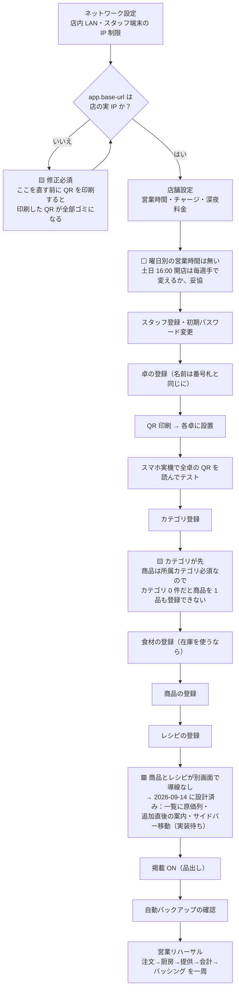
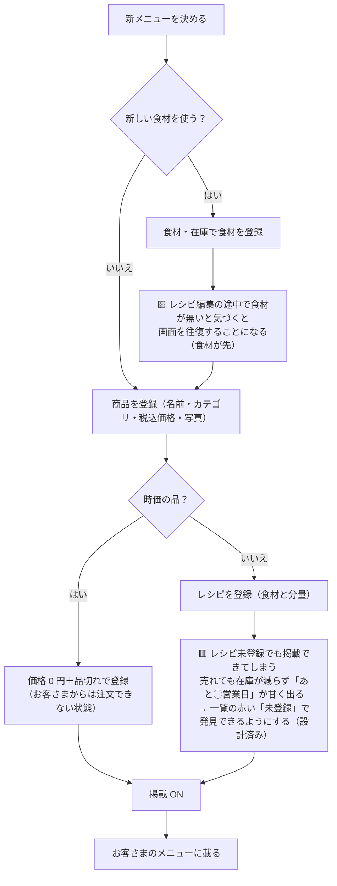
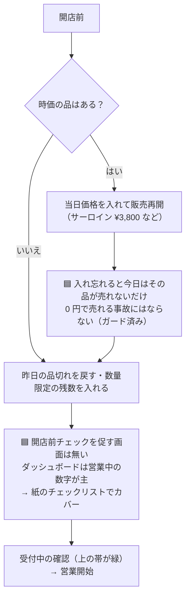
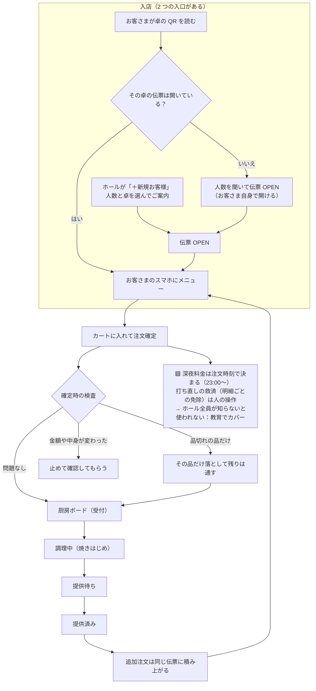
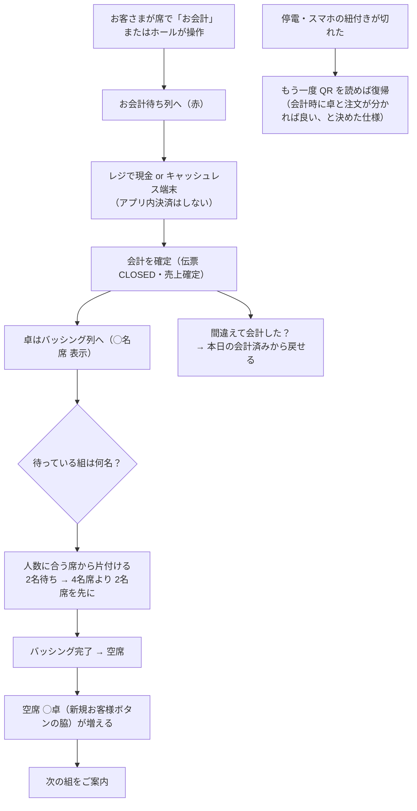
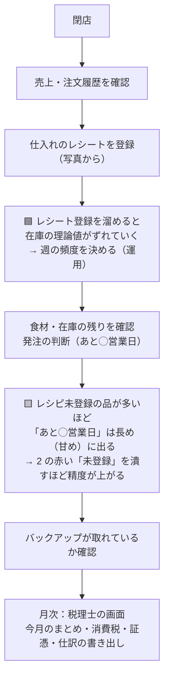

# 店舗導入のフローチャート（矛盾を探すための地図）

QR コード注文を「米粉と鉄板」に実際に入れる前提で、店の仕事の流れを図にしたもの。
商品とレシピの分断（2026-09-14 に発覚）のような**画面どうしの矛盾・順序の罠**を、
導入前に洗い出すのが目的。⚠ が付いている箱がその候補。

凡例：🟥 矛盾（直す対象）／🟨 順序の罠（知らないと詰まる）／🟦 運用でカバー（システムは強制しない）／⬜ 決めて捨てたこと

---

## 1. 導入前の準備（一度だけ）

- 🟨 **base-url → QR 印刷の順序**は最重要。逆にすると貼り直し。現状 dev 設定は `192.168.1.4` のままで実 IP と不一致（既知）。
- 🟨 **サイドバーの並びと作業順序が逆**な箇所が残る：初期設定は「カテゴリ → 商品」の順だが、画面の並びは商品が上。初回だけの話なので導線までは作らない（リハーサル手順書でカバー）。

---

## 2. 新メニューを出す（繰り返しの仕事）

- ✅ 確認済み：**価格 0 円のままの販売再開は画面が断る**（2026-09-07 のガード）。0 円で注文できる品は構造的にできない。

---

## 3. 毎日の開店前

---

## 4. 来店 → 注文 → 提供（営業中）

- ✅ 整合確認済み：入口が 2 つあっても人数の**二重入力にはならない**（既に開いた伝票では人数画面が出ない。開いた伝票の人数を客側から減らすこともできない）。
- ✅ 残数 0 の品はスタッフ注文でも必ず断る（売り越し防止）。

---

## 5. 会計 → バッシング → 次の組

---

## 6. 閉店後・月次

---

## 7. 見つかっている矛盾・穴の一覧

| # | 種類 | 内容 | 状態 |
|---|---|---|---|
| 1 | 🟥 矛盾 | 商品の登録とレシピの登録が別画面で、導線がゼロ。登録漏れが起きる前提の作りだった | **設計済み**（原価列・追加直後の案内・サイドバー移動）。実装待ち |
| 2 | 🟥 矛盾 | レシピ未登録でも掲載でき、在庫と原価が黙って狂う | #1 の赤い「未登録」で見えるようにする |
| 3 | 🟨 順序の罠 | base-url を直す前に QR を印刷すると全部無駄になる。現状 dev は実 IP と不一致 | **導入前の必須手順**として 1 の図に固定 |
| 4 | 🟨 順序の罠 | カテゴリ 0 件だと商品が登録できない／食材が無いとレシピで手が止まる | リハーサル手順書でカバー（初回だけ） |
| 5 | 🟦 運用 | 時価の品の当日価格は毎営業日の人手作業。忘れてもその品が売れないだけ（0 円販売はガード済み） | 開店前チェックリストへ |
| 6 | 🟦 運用 | 深夜料金の打ち直し救済（明細ごとの免除）は知らないと使われない | スタッフ教育へ |
| 7 | 🟦 運用 | 営業中の価格変更は「販売中止 → 変更 → 再開」の手順をシステムは強制しない | 手順書へ（仕様.md 4.6.1） |
| 8 | ⬜ 決めた | 曜日別の営業時間なし（土日 16:00 は手動） | 導入後に痛ければ再検討 |
| 9 | ⬜ 決めた | 停電時の紐付き切れは QR 再読みで復帰 | 2026-09 に店主と合意済み |
| 10 | ❓ 要確認 | レシピ編集の画面から食材の新規登録に飛べるか（飛べないなら 4 の往復が毎回起きる） | 次の実装のときに確認 |
| 11 | ❓ 要確認 | 棚卸（実在庫と理論在庫の突き合わせ）の置き場所。手修正の入口がどこか | docs\現場の話_発注と棚卸_2026-09-05.md と突き合わせる |

---

*作成 2026-09-14。フローの事実関係（0 円ガード・QR 直読みでの伝票 OPEN・残数 0 の拒否）はコードで確認済み。*
