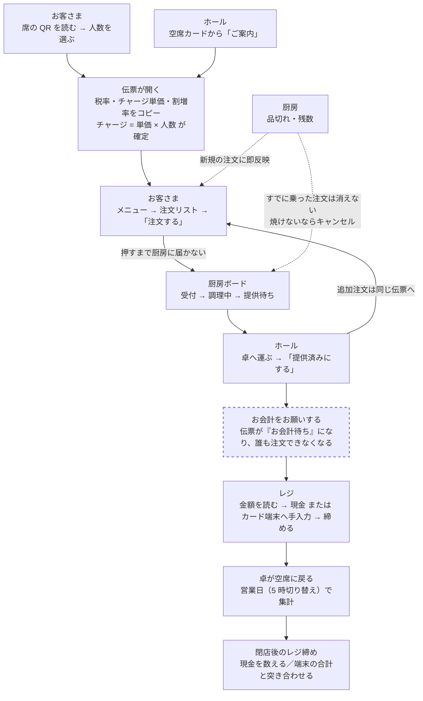

# 来店から退店までの流れ

この文書は、**お店の人に読んでもらって「そこは違う」と言ってもらうため**のものです。

いま動いているシステムが、お店の仕事をどう想定しているかを順番に書きました。
書いてあるのは私が決めた想定であって、正解ではありません。
**違うところを指摘してもらうことが、この文書の目的です。**

最後に「確認してほしいこと」を 11 個並べてあります。
そこだけ読んでも構いません。

---

## 登場人物と道具

| | 使う人 | 道具 |
|---|---|---|
| お客さま | 自分のスマホ | 席に貼ってある QR コード |
| 厨房 | 厨房の担当 | 厨房ボード（タブレット） |
| ホール | 運ぶ人・会計する人 | ホール・会計画面 |
| 店長 | 店長のみ | 管理画面（商品・卓・売上など） |

QR は**卓ごとに 1 枚**です。お店に 1 枚ではありません。
どの QR を読んだかで「どの席の注文か」が決まります。

---

## 全体の流れ



破線の枠（お会計をお願いする）は**これから作るぶん**です。

この図の要点は 4 つです。

- 入口が 2 つある（お客さまの QR と、ホールの「ご案内」）
- 提供のあと注文へ戻れる（追加注文）。一巡で終わらないのが居酒屋
- 品切れは 2 方向に効く。**新規の注文は止まるが、すでに厨房ボードに乗った注文は止まらない**
- **レジで金額を手で打つ工程がある**。システムから端末への転記はここだけ人の手

**店主に見せる用の図はこちら**（レーン分けと確認事項つき）:
https://claude.ai/code/artifact/3afb90b6-fdf4-4e61-a4a9-f22b2116b341

---

## 1. ご来店・ご案内

**伝票を開く方法が 2 つあります。どちらでも構いません。**

**A. お客さまが QR を読む**
席に貼ってある QR をスマホで読むと、人数を選ぶ画面が出ます。
1〜8 名はボタン、9 名以上は数字を入れて「決定」。20 名まで。

**B. スタッフがホール画面から**
ホール・会計画面の空席カードで人数を選び「ご案内」を押します。

どちらでも、押した時点で**その卓の伝票が開きます**。

**すでに開いている卓に、あとから人数の申告が来たとき**

- スタッフからの申告 … 増やすのも減らすのも、そのとおりにします
- お客さまからの申告 … **増やす方向だけ**反映します

6 名でご案内した卓に、遅れて来た 1 人が QR を読んで「1名」を送っても、
6 名のままにするためです。減らすときはスタッフが伝票画面で直します。

**この瞬間に決まるもの**

伝票は、ご案内した時点のお店の設定を**コピーして持ちます**。

- 消費税率（10%）
- テーブルチャージの単価（¥450 / 人）
- 深夜料金の割増率（10%）

あとから店舗設定を変えても、**すでに開いている伝票の金額は変わりません**。
新しい金額は、次にご案内する卓から適用されます。

ただし**深夜料金の時間帯（23:00〜5:00）だけはコピーしません**。
毎回いまの設定を見にいくので、営業中に時刻を変えると開いている伝票にも即座に効きます。

テーブルチャージは **単価 × 人数** で、この時点で金額が決まります。

---

## 2. ご注文

お客さまは自分のスマホでメニューを見ます。

**タブ（4 つ）→ カテゴリ（14 個）→ 商品（94 品）** の順に並んでいます。
タブは左右のスワイプでも切り替わります。

商品を押すと、オプションを選ぶ画面が出ます。

- お好み焼き … 米粉そば / 米粉うどん（どちらか 1 つ・無料）
- たこ焼き … 味を 2 種類または 4 種類ちょうど選ぶ

カートに入れて、注文リストで数量を変えたり消したりできます。
**「注文する」を押すまでは、厨房には何も届きません。**

**注文できないとき**

- 開店前・ラストオーダー後 … 押せません
- 店長が受付を止めているとき … 押せません
- その卓が「使わない」設定のとき … QR を読んでも開けません
- 品切れの品 … メニューに「売り切れ」と出て選べません

**同じ卓から何度でも追加注文できます。** 全部 1 つの伝票に積み上がります。

---

## 3. 厨房

注文が確定すると、**厨房ボードに音が鳴って**カードが出ます。

左から右へ 3 つのレーンがあります。

```
受付  →  調理中  →  提供待ち  →（提供済み）
```

- 「焼きはじめ」を押すと 調理中へ
- 「焼き上がり」を押すと 提供待ちへ
- 「提供済みにする」を押すと、ボードから消えます

**受付から「焼き上がり」を直接押すこともできます**（調理中を飛ばせます）。

注文から **15 分** たったカードは赤枠になります。

**キャンセル**は厨房ボードからできます。押すと伝票の合計からも自動で外れます。

---

## 4. 提供

提供待ちの品を、卓へ運びます。

運んだあと、**厨房ボードで「提供済みにする」を押します**。
このボタンは厨房ボードにしかありません。

---

## 5. 品切れ・残数（営業中）

厨房の「品切れ・残数」画面で操作します。

**品切れにする** … 押した瞬間から、各卓のメニューで注文できなくなります。
**すでに厨房ボードに乗っている注文は消えません。**
焼けないと分かった時点で、ボード側からキャンセルしてください。

**残数** … 数量限定の品に今日の数を入れると、注文のたびに自動で減り、
0 になった瞬間に売り切れ表示になります。キャンセルされた分は戻ります。
数を数えるのをやめるときは、欄を空にして「設定」を押します。

---

## 6. お会計

ホール・会計画面で、その卓の「伝票を見る／お会計」を押します。

```
小計（キャンセルを除いた注文の合計・税込）
＋ テーブルチャージ（¥450 × 人数）
＋ 深夜料金（深夜に出た注文の合計 ＋ 深夜に案内した卓のチャージ、に 10%）
＝ ご請求額
```

消費税はこの中に含まれています（内税）。深夜料金は 1 円未満を切り捨てます。

**深夜料金は「注文した時刻」で決まります。お会計の時刻ではありません。**
22:00 の注文は通常料金、23:30 の注文は深夜料金。同じ伝票に混ざります。

**深夜料金を外すことができます。2 段階あります。**

- 注文 1 件ずつ外す … 主に**打ち直しの救済**です。22:55 の注文を 23:05 に取り消して
  23:06 に入れ直すと時刻が新しくなり 10% が乗ります。お店のミスで高くなるので外せます
- 伝票ごと外す … 会計時のサービス対応

**お支払いはシステムの外です。** レジで現金・キャッシュレス端末で受け取ります。
システムは「いくらか」を出すところまでで、決済はしません。

「お会計」を押すと伝票が締まり、卓が空席に戻ります。

**間違えて締めたときは、会計を取り消せます**（伝票画面から）。

---

## 7. 締めたあと

会計済みの伝票は、ホール画面の下に「本日の会計済み」として残ります。

売上は**営業日**で数えます。営業日の切り替えは **5 時**です。
深夜 0 時〜4 時 59 分の注文は、前日の売上として集計されます。
注文番号も前日からの続き番号になります（その日の 1 件目が 101 番）。

---

## 確認してほしいこと（11 個）

ここが、私が決めてしまった想定です。**違うものを教えてください。**

**1. 伝票を開くのは誰ですか**
いまは「お客さまが QR で開く」「スタッフがホールから開く」の両方ができます。
どちらを標準にしますか。片方だけにしたほうが迷わないなら、片方を消せます。

**2. 人数の初期値が 2 か所で違います**
スタッフのホール画面は **2 名** が初期値、お客さまの画面は**その卓の席数**が主役の色になっています。
どちらが実際に近いですか。

**3. お客さまからの「減らす」申告を無視しています**
4 名で入って 2 名に減ったとき、お客さまの画面からは直せません。スタッフが直します。
この運用で困りませんか。

**4. 「焼きはじめ」を押す余裕がありますか**
押さずに「焼き上がり」だけ押す運用なら、**調理中のレーンは要りません**。
2 レーンにすると 1 枚のカードが大きくなり、押しやすくなります。

**5. 「提供済みにする」を押すのは誰ですか**
いまは厨房ボードにしかありません。運んだ人が厨房へ戻って押す形になります。
ホール側でも押せたほうがいいですか。

**6. 厨房ボードは何台ありますか**
1 台を厨房とホールで見る想定です。2 台以上あると、同じ注文を 2 人が同時に進める場面が出ます。

**7. 品切れを入れるのは誰で、いつですか**
仕込みの段階でまとめて入れるのか、切れた瞬間に入れるのかで、
画面の作りが変わります（まとめてなら一覧、その場でなら 1 タップ）。

**8. 15 分で赤枠、で合っていますか**
お好み焼きは調理 12 分、鉄板おつまみは 8 分で登録してあります。
品によって赤くなる時間を変えるべきですか。

**9. 打ち直しで深夜料金が乗る件**
22:55 の注文を取り消して 23:06 に入れ直すと 10% 乗ります。外す機能はありますが、
**忙しい時間に外し忘れませんか。** 自動で救うべきなら、そう作れます。

**10. お客さま全員がスマホで注文しますか**
いまは 4 人組なら 4 人がそれぞれ QR を読んで、それぞれのスマホから注文できます。
カートは端末ごと、伝票は 1 つです。代表者 1 人だけが注文する運用ですか。

**11. お会計は必ずレジですか**
卓でお会計をする運用はありませんか。

---

## システムがやらないこと

意図的に入れていません。必要なら作れますが、いまは無い、ということです。

- **オンライン決済**（お支払いはレジ）
- **予約**
- **テイクアウト・番号呼び出し**
- **会員登録・ポイント**
- **年齢確認**（スマホからはできないので、提供時に店頭で）
- **曜日別の営業時間** … **土日 16:00 開店に対応していません。** 営業時間の設定は 1 組だけです
- 複数店舗

---

## 2026-08-29 追記

### 答えが出たこと

- **お会計はレジまで来てもらう。** 卓ではカードを切らない（上の質問 11 の答え）
- **カードと現金は混ぜない。** 1 伝票につき 1 つの支払い方法にする仕様と決めた
- **レシートはクレジット端末から出るものだけ。** システムからは印刷しない
- **お会計の合図を、お客さま側から出せるようにする**（これから作る）

### 図に抜けていた工程が 2 つありました

**レジでの手入力。** 画面のご請求額を目で読んで、隣のクレジット端末に手で打ちます。
システムから端末への転記はここだけ人の手で、¥11,044 を ¥1,104 と打っても
システム側は気づけません。

**閉店後のレジ締め。** 現金を数え、端末の当日合計を出し、システムの売上と突き合わせます。
ところが**システムは現金とカードを分けて持っていない**ので、
「金庫にあるべき現金」が出せず、合っているかどうか確かめられません。

### 「お会計待ち」はスキーマ変更なしで作れます

同時実行の話から出てきた設計です。会計を 2 段階にします。

1. 注文の受付を止める（お客さまの「お会計おねがいします」／店員の操作）
2. レジで金額を確定して締める

①と②の間は誰も注文できないので、「金額を出したあとに注文が入る」が起きません。
ロックで裏側で捌くのではなく、**状態を人に見せて解決する**形です。

実装は次の 3 つで足ります。**列は増えません。**

- `SessionStatus` に `CLOSING` を足す。`status` は `VARCHAR(20)` で `CLOSING` は 7 文字なので入る
- `isOrderable()` が `CLOSING` で false を返すようにする
- `OrderService.placeOrder` は既に伝票をロックしたうえで `isOrderable()` を見ているので
  （`OrderService.java:132` 付近）、**既存の確認処理がそのまま効きます**

#### 入口は 2 つ。店員側だけ確認をはさむ

口頭で「お会計おねがいします」と言われる場合があるので、**店員側からも開始できるようにします。**

| 押す人 | 場所 | 確認 |
|---|---|---|
| お客さま | 伝票画面の「お会計おねがいします」 | 不要 |
| 店員 | ホール画面の卓のカードの「お会計」 | **要る** |

店員側にだけ確認をはさむ理由は、**ホール画面には卓のカードが 10 枚並ぶ**からです。
隣の卓を押すと、まだ食事中の卓の注文を止めてしまいます。
お客さまは自分の卓しか触れないので、その事故は起きません。

確認の形は、既存の会計確定ボタン（`bill.html` の `komekoConfirmClose`）と同じにします。
あちらは「押し間違いが実店舗で一番こわい操作なので」という理由で、
卓名とご請求額を読み上げられる形で出しています。同じ形を 1 段階手前に置くだけです。

```
テーブル3 をお会計待ちにします。
現在のご請求額 ¥11,044
この卓からの追加注文が止まります。よろしいですか？
```

金額を出すのは、押し間違い防止だけでなく、**口頭で聞かれたときにその場で答えられる**ためでもあります。

なお `confirm()` は「うっかり」を止めるためのもので、本当の歯止めではありません
（JavaScript は無効にできる）。サーバ側でも、伝票が `OPEN` のときだけ
`CLOSING` に進めるよう検査します。既存の他の操作と同じ方針です。

### 増えた質問

上の 11 個のうち、11 番は答えが出ました。残り 10 個に次の 3 つが加わります。

**12. お会計待ちのあとの追加注文はありますか**
「やっぱりもう一杯」があるなら、店員が締め切りを解除する操作が要ります。

**13. クレジット端末への打ち間違いは起きていますか**
起きているなら、読み上げやすい形（大きく出す、カンマを消す）に変える価値があります。

**14. 現金とカードを分けて記録しますか**
レジ締めで現金が合うか確かめるために要ります。カードは月末締め・翌月払いなので、
入金の管理という意味でも分かれていたほうがよさそうです。

**15. テーブルチャージを外したいことはありますか**
常連さん、お子さま連れ、こちらの手違いでお待たせしたとき、など。
**いまは外す手段が 1 つもありません**（`TableSession.java:231` で
`単価 × 人数` を計算しているだけで、免除の項目が無い）。
深夜料金には免除が 2 段階あるのに、チャージには無い、という食い違った状態です。

### テーブルチャージの免除を「注文キャンセルと同じ扱い」にはできません

チャージを注文の 1 行として持たせれば、キャンセルの仕組みをそのまま流用できます。
ただし注文である以上、次の巻き添えが出ます。

- **厨房ボードにチケットが出る**（「テーブルチャージ ×4」を焼くことになる）
- 注文ベースの売上に混ざる。売上画面が「お会計ベース（チャージ込み）」と
  「注文ベース（チャージ抜き）」をわざわざ分けて説明している区別が壊れる
- チャージ用の商品を商品管理に作ることになり、品切れ・残数の一覧にも並ぶ
- 人数を変えたら行を作り直す処理が要る（いまは計算し直すだけ）

**構造が同じものは深夜料金のほうです。** どちらも「明細の行ではなく、
小計に上乗せする計算値」で、「来店時の設定をコピーして持つ」。
深夜料金は `lateNightWaived` で免除を記録しているので、
チャージも `tableChargeWaived` を足して `recalculate` で見るのが素直な形です。
「人の判断を記録として残す」という性質は、これで満たせます。

### Flyway（マイグレーション）が要る理由は 2 つになりました

1. **決済手段の記録**（現金／カード）… 質問 14
2. **テーブルチャージの免除フラグ** … 質問 15

どちらも列を 1 本足す話なので、先にマイグレーションの仕組みが要ります。
逆に言うと、この 2 つを「要らない」と決めるなら、Flyway は当面いりません。

### 図の最新版

番号を振り直した最新版はこちらです（8 場面・確認事項 13 件）。
https://claude.ai/code/artifact/3afb90b6-fdf4-4e61-a4a9-f22b2116b341
